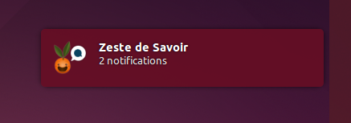

===============================
Zds Indicator
===============================

Un applet Ubuntu pour Zeste de Savoir. Testé pour l'instant sur Ubuntu 14.04 et 14.10.

Screenshots
-----------

Requis
------
 * python-appindicator
 * lxml
 * requests

Installation
------------

Installer tout d'abord les dépendances. Télécharger la dernière archive disponible, puis l'extraire.
Une fois dans le répertoire de l'application :

    .. code::bash
        python setup.py install

Pour lancer l'application :

    .. code::bash
        zdsindicator
